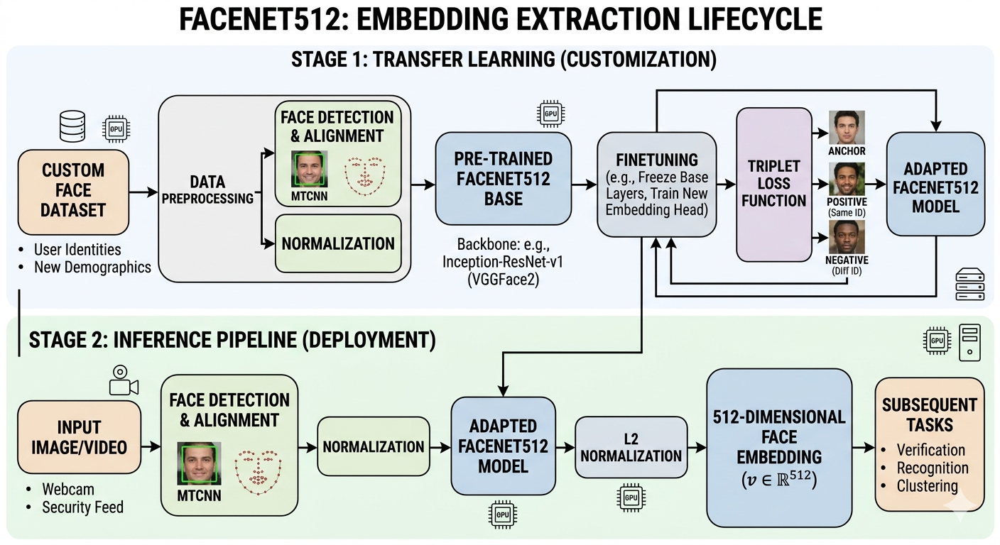

# Dual-Comparison Face Recognition System

This repository contains a production-grade, modular biometric identity system designed for **Real-time Authentication (Live $\leftrightarrow$ Live)** and **KYC/Onboarding Verification (Live $\leftrightarrow$ Doc)**. It utilizes state-of-the-art Deep Learning models for face detection, alignment, and high-dimensional embedding extraction.

---
## Demo

[]()


## Key Features
* **Dual-Path Verification:** Supports matching live camera feeds against both a registered gallery and scanned ID documents.
* **High-Speed Vector Search:** Integrated with **FAISS** for sub-millisecond similarity lookups across millions of identities.
* **Production ML Pipeline:** Powered by **InsightFace (ArcFace/RetinaFace)** for robust, illumination-invariant facial embeddings.
* **Anti-Spoofing Hook:** Built-in liveness detection stage to prevent presentation attacks (photos, screens, masks).
* **Transfer Learning Suite:** Scripts included for fine-tuning **FaceNet** (embeddings) and **RetinaNet** (detection) on custom datasets.

---

## System Architecture
The system follows a linear pipeline optimized for low-latency inference:

1.  **Ingestion:** Captures BGR frames from live streams or static ID scans.
2.  **Preprocessing:** Detects, crops, and aligns faces using 106-point landmarks.
3.  **Extraction:** Maps facial features to a normalized **512-D vector space**.
4.  **Vector DB:** Performs Approximate Nearest Neighbor (ANN) search using Inner Product (Cosine Similarity).
5.  **Decision Logic:** Applies similarity thresholds ($\ge 0.45$) and cross-checks metadata (Name, DOB).

[]()

---

## Directory Structure

```text
face-recognition-system/
├── src/                    # Production Inference Pipeline
│   ├── orchestrator.py      # Main Pipeline Controller
│   ├── preprocessing.py     # Detection & Liveness
│   ├── extraction.py        # InsightFace Wrapper
│   └── vector_database.py   # FAISS Vector Storage
├── training/               # Model Fine-tuning Scripts
│   ├── transfer_learning_embedding.py
│   └── transfer_learning_retinanet.py
├── tests/                  # Validation & Evaluation
│   └── visualize_result.py  # LFW Dataset Runner
├── models/                 # Model Weights (.pth / .onnx)
├── data/                   # Datasets & Mock Data
└── requirements.txt        # System Dependencies
```

---

## Setup & Installation

### 1. Environment Setup
It is recommended to use Python 3.10+ and a virtual environment.

```bash
# Clone the repository
git clone https://github.com/Tanupvats/kyc-fraud-face-recognition-system.git
cd face-recognition-system

# Install dependencies
pip install -r requirements.txt
```

### 2. Dependency Note
For GPU acceleration on Nvidia hardware, ensure you have the appropriate runtimes:
```bash
pip uninstall onnxruntime faiss-cpu
pip install onnxruntime-gpu faiss-gpu
```

---

## Usage

### Inference (Orchestrator)
The `FaceRecognitionSystem` class provides the primary interface for your application:

```python
from src import FaceRecognitionSystem

# Initialize
fr_system = FaceRecognitionSystem(similarity_threshold=0.45)

# Verify Live vs Live
is_verified = fr_system.verify(
    input_image=frame, 
    target_user_id="USR_123", 
    mode="LIVE_TO_LIVE"
)
```

### Training RetinaNet (Transfer Learning)
To adapt the system to specific hardware or lighting conditions, use the transfer learning scripts:
[]()
```bash
# Fine-tune RetinaNet face detection
python training/transfer_learning_retinanet.py
```

### Training FaceNet (Transfer Learning)
To adapt the system to specific hardware or lighting conditions, use the transfer learning scripts:
[]()
```bash
# Fine-tune FaceNet embeddings
python training/transfer_learning_embedding.py

```

### Testing & Visualization
Run the end-to-end demo using the **Labeled Faces in the Wild (LFW)** dataset:

```bash
python tests/visualize_result.py
```

---

## Security & Compliance
* **Privacy:** This system uses L2-normalized embeddings. It is designed to store mathematical vectors rather than raw images to comply with **GDPR/CCPA** data minimization principles.
* **Liveness:** For production deployment, ensure the `_liveness_check` in `preprocessing.py` is linked to a validated Anti-Spoofing ONNX model.
* **Auditability:** Every transaction generates a unique `TX_ID` logged in the audit trail for fraud investigation.


